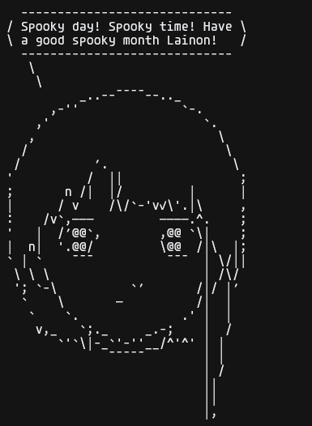

A remake of the `cowsay` program, but with ASCII Lain from the anime Serial Experiments Lain, & written in the Zig Programming Language. For a lack of a better name I call it... `LainSay.zig`.

I made this for a, "Simple/Small Programs" thread I found over on Lainchan.

## Rules of thread
You can do anything you want as long as:
- It's on one file.
- Is under 150 lines.

## How to run
- Clone the project
- Install the Zig compiler (This was written using Zig version 0.13.0)
- Make sure you are in the same directory as the `LainSay.zig` file within your terminal.
- Compile the script: `zig build-exe LainSay.zig`
- Run the program. And have a blast :)

## Credits
I'm not sure who the original creator of the Lain ASCII art is but I would like to thank `A GUEST` over on Pastebin for making it available.